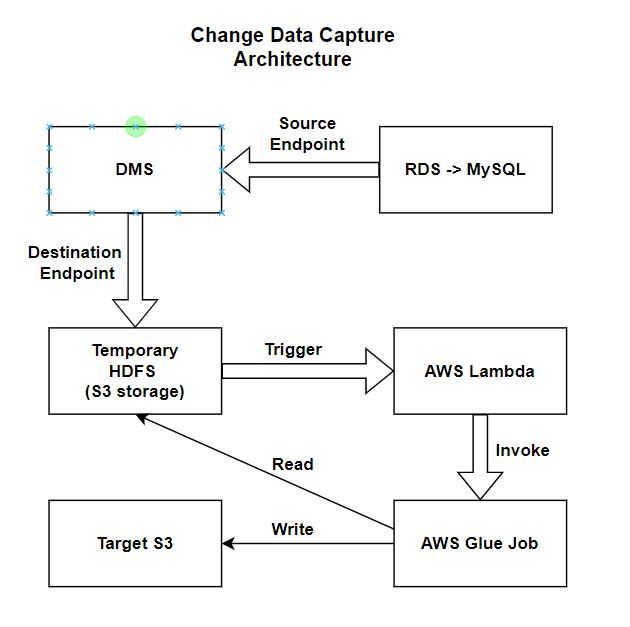

# Change-Data-Capture

A data project that uses AWS Tools to migrate the data changes from MySQL instance to a target S3 bucket

## Project Architecture

The below explained mechanism remains the same for the case of full load (initial migration) as well as replication ongoing.

1. The data comes from the local MySQL instance. I'm using AWS Data Migration Service (DMS) to migrate the data from the MySQL instance to a source S3 bucket.

2. As soon as there is a change in source S3 bucket content, it triggers an AWS Lambda function, which in turn triggers an AWS Glue job.

3. This Glue job reads the data from the source S3 bucket and transforms the data using Pyspark and finally stores the data in a target S3 bucket as one file.

The below diagram shows the project architecture.

